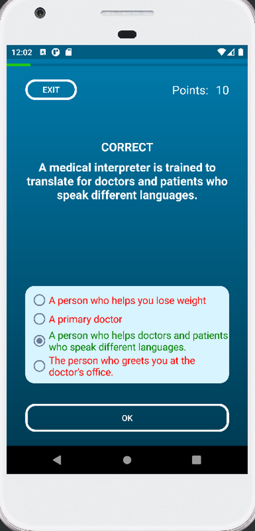
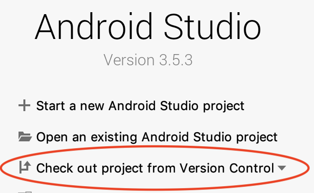
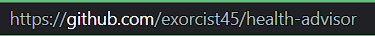

# Health Quiz Android App

This is a group project that I worked on with three other fellow classmates for the Android Mobile Application Development course from March to May 2022. The goal of this project was to create a health advisor app which can create awareness among people along with providing them with proper resources. We accomplished creating a stylistic and functional Android app using Android Studio and mySQL to manage a database of questions/answers. 

### Getting Started 
To run this project open Android Studio and select "Check out project from Version Control" 

Then paste this repo's URL (https://github.com/exorcist45/health-advisor)

Once the project files have loaded, select the type of Android phone you want to simulate (or plug in one) and click the play button to run the app

### Built With 

* Android Studio - IDE
* mySQL - Database of questions and answers 

### Authors 

* Ashutosh Chauhan - exorcist45
* Shivansh 
* Harshit Gupta
* Muzzamil

